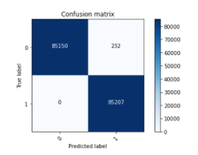
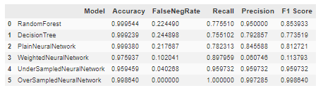

# Credit Card Fraud Detection 

This project aims to identify fraudulent transactions with credit cards using various machine learning models. The objective is to build a fraud detection system leveraging machine learning techniques. The dataset contains 300,000 fully anonymized transactions, each labeled as either fraudulent or not fraudulent.

## Dataset

The dataset used in this project can be found [here](https://www.kaggle.com/datasets/mlg-ulb/creditcardfraud).

## Problem Statement

The prevalence of fraudulent transactions is very low in the dataset, with less than 0.1% of the card transactions being fraudulent. This imbalance necessitates the use of adjustment techniques in model training to ensure accurate detection.

## Techniques Used

The project compares the performance of different machine learning and deep learning models:

- Machine Learning Techniques:
  - Random Forest
  - Decision Trees
- Deep Learning Techniques:
  - Neural network using fully connected layers

Performance of the neural network is compared for different optimization approaches, including plain binary cross-entropy loss minimization and various methods to address class imbalance such as weighted loss, under-sampling, and over-sampling using SMOTE.

## Results

The best results are achieved by over-sampling the under-represented class using SMOTE. With this approach, the model is able to detect 100% of all fraudulent transactions in the unseen test set while maintaining an acceptable number of false positives.

Confusion matrix achieved using SMOTE over-sampling and a simple dense neural network:

Comparison of key performance indicators between the tested approaches:

